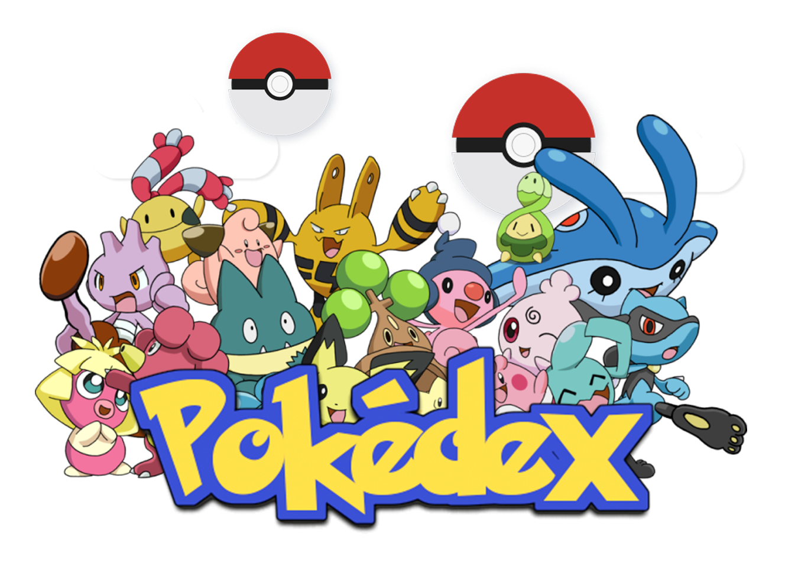
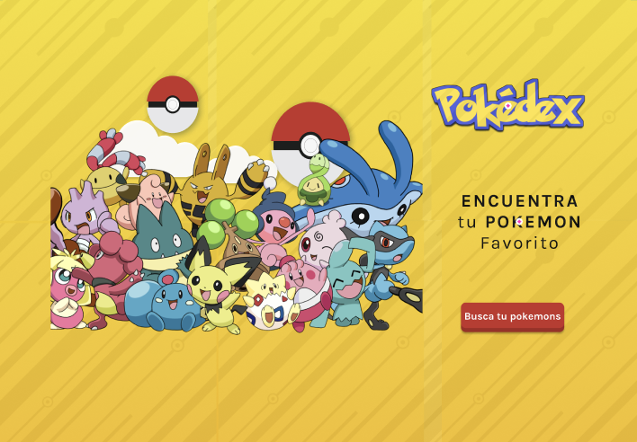
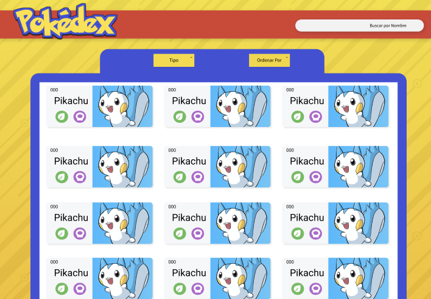
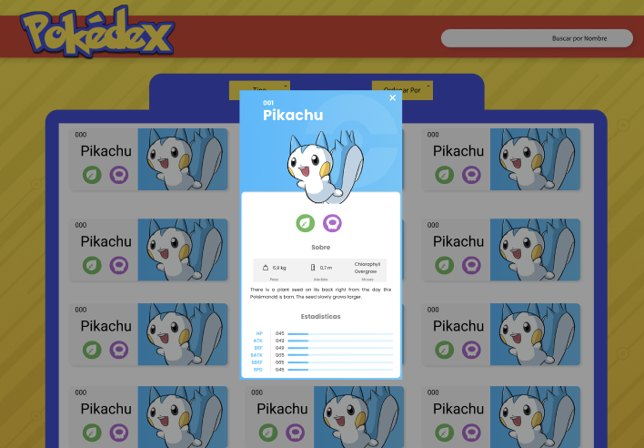
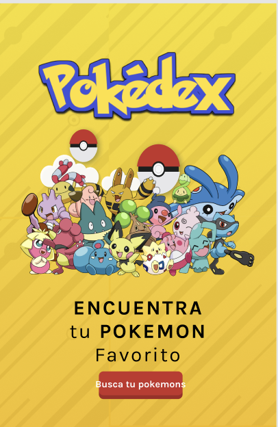
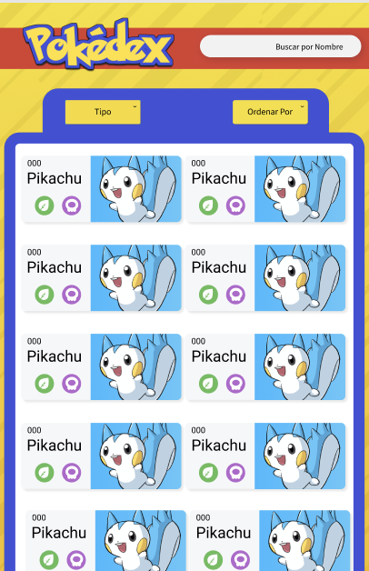
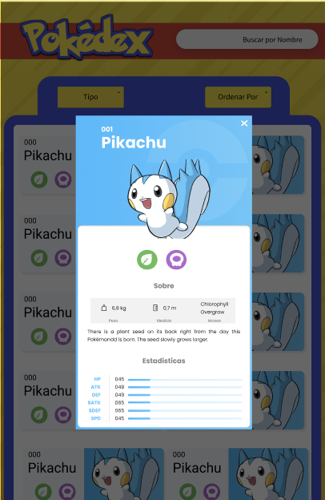
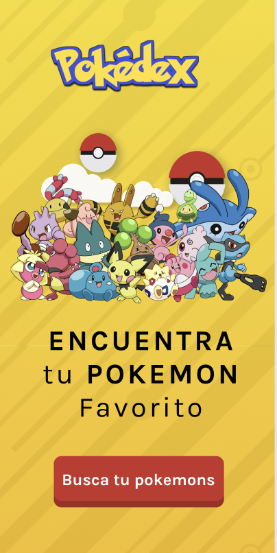
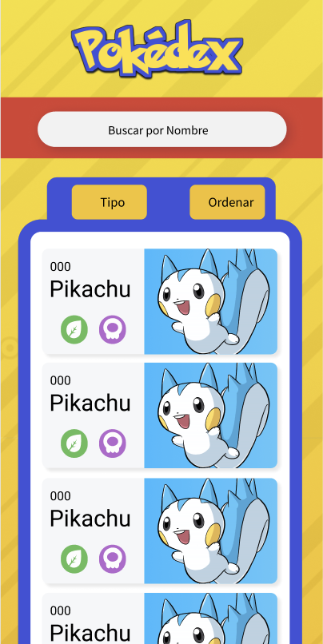
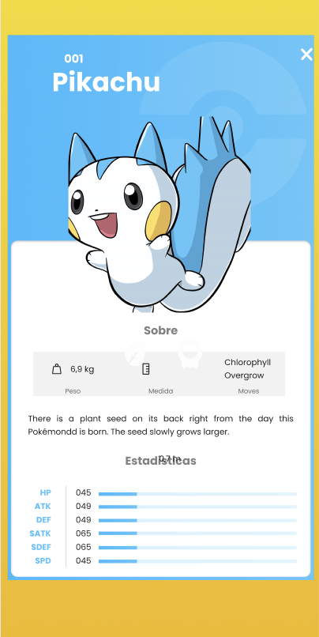

# Data Lovers – Pokédex

## Índice 🎯

1. [**Resumen del proyecto**]()
   
2. [**Proceso UX-UI**]()
  
3. [**Investigación UX**]()
   
4. [**Objetivos de aprendizaje**]()
   
5. [**Pruebas Unitarias**]()
   
6. [**Checklist**]()

---

## 1. Resumen del proyecto 📝

El objetivo de este proyecto, es **construir una página web responsive** que proporcione información relevante a nuestros usuarios. Para lograrlo, vamos a utilizar un archivo llamado "data.js" que contiene detalles sobre `251 Pokémones`. A partir de este archivo, importaremos y extraeremos los datos necesarios para mostrar la información según las preferencias de los usuarios. De esta manera, los usuarios estarán `filtrando`, `ordenando` y obteniendo un `cálculo agregado` de la data, para satisfacer sus necesidades. El propósito principal de estas funcionalidades es mejorar la experiencia de los usuarios, permitiéndoles adquirir diferentes características de los Pokémones para mejorar sus estrategias de juego o simplemente teniendo toda la información en un solo lugar.

### 2. Proceso UX-UI 👩🏻‍🎨🎨

[UX-Kit](<https://www.figma.com/file/UwWD2NwwPNv8eSDmJH8Hh9/Pokedex---Laboratoria-(Dev-007)?type=design&node-id=2-5&t=FnhaUHLWuEIGak1v-0>).
Nuestro objetivo principal es transmitir la información de manera clara y precisa, al mismo tiempo que brindamos una experiencia visualmente agradable para nuestros usuarios. Para lograr esto, nos hemos enfocado en utilizar un diseño limpio y simple que facilite el reconocimiento de la interfaz de nuestra página web de manera rápida.

Nuestro enfoque se basa en los siete principios básicos de diseño, también conocidos como la Teoría de la Gestalt, los cuales nos ayudan a crear una composición armoniosa y coherente en la presentación de la información.


### Responsividad - Vista Final Desktop 💻




[Figma-Desktop](<https://www.figma.com/file/UwWD2NwwPNv8eSDmJH8Hh9/Pokedex---Laboratoria-(Dev-007)?type=design&node-id=2-3&t=LMI1PkSmb9tgYTtU-0>).

### Responsividad - Vista Final Tablet 📱





[Figma-Tablet](<https://www.figma.com/file/UwWD2NwwPNv8eSDmJH8Hh9/Pokedex---Laboratoria-(Dev-007)?type=design&node-id=82-4159&t=KkEHqOFloPmDJ3lj-0>).

### Responsividad - Vista Final Mobile 📲





[Figma-Mobile](<https://www.figma.com/file/UwWD2NwwPNv8eSDmJH8Hh9/Pokedex---Laboratoria-(Dev-007)?type=design&node-id=82-4160&t=KkEHqOFloPmDJ3lj-0>).

## 3. Investigación UX 🔍

📝**Historia de Usiario 1 - Visualizar todos los Pokémones**

```sh
🗣️ Como entrenador Pokémon, deseo que al acceder a mi Pokédex, pueda observar una lista completa de todos los Pokémon disponibles. De esta manera, podré conocer qué Pokémon se encuentran registrados en mi Pokédex.
```

📍 **Sprint-Entregable:**

- [✔️] El usuario debe poder visualizar en la pantalla la imagen del pokemon, el nombre, el numero de pokemon que es , Max-CP de los 251 pokémones.
- [✔️] Puede buscar en el Search el nombre de los Pokemones, ingresando letra a letra.
- [✔️] La visualización de los pokémones debe poder hacerse fácilmente desde cualquier dispositivo.

📝**Historia de Usiario 2 - Visualización de pokémon por tipo**

```sh
En mi calidad de entrenador Pokémon, deseo tener la capacidad de filtrar los Pokémon en mi Pokédex según su tipo de elemento (como fuego, tierra, agua, etc.). Esto me permitirá identificar fácilmente qué Pokémon comparten un tipo de elemento específico y conocer sus características correspondientes.
```

📍 **Sprint-Entregable**

- [✔️] El usuario puede identificar una lista desplegable de nombre "Tipo".

📝**Historia de Usiario 3 - Ver el CP-MAX Y el orden por número**

```sh
🗣️ YO, COMO usuario pokémon , Quiero ver el CP-MAX, de cada Pokemon, a penas entro a mi Pokedex y poder ordenarla de Mayor a Meno.
```

📍 **Sprint-Entregable**

- [✔️] El usuario puede identificar esta área en el pequeño Navegador.
- [✔️] Todos los Pokemones entregan en la Card prncipal toda la información necesarios

📝**Historia de Usiario 4- Búsqueda personalizada y Ficha técnica**

```sh
🗣️ YO, COMO usuario pokémon , QUIERO poder buscar un pokemon en especifico PARA acceder a todas sus características
de manera rápida y además ver una inrformación detallada de cada uno.
```

📍 **Sprint-Entregable**

- [✔️] El usuario debe poder identificar el buscador.
- [✔️] El usuario debe poder buscar a los pokemones a través de su nombre.
- [✔️] El usuario al hacer click puede tener información más detallada de cada Pokemon como un ficha técnica.

## 4. Objetivos de Apredizaje 

### UX

- [x] Diseñar la aplicación pensando y entendiendo al usuario.
- [x] Crear prototipos para obtener feedback e iterar.
- [✔️] Aplicar los principios de diseño visual (contraste, alineación, jerarquía).
- [✔️] Planear y ejecutar tests de usabilidad.

### HTML y CSS

- [✔️] Entender y reconocer por qué es importante el HTML semántico.
- [✔️] Identificar y entender tipos de selectores en CSS.
- [✔️] Entender cómo funciona flexbox en CSS.
- [✔️] Construir tu aplicación respetando el diseño planeado (maquetación).

### DOM

- [✔️] Entender y reconocer los selectores del DOM (querySelector | querySelectorAll).
- [✔️] Manejar eventos del DOM. (addEventListener)
- [✔️] Manipular dinámicamente el DOM. (createElement, appendchild, innerHTML, value).

### Javascript

- [✔️] Manipular arrays (filter | map | sort | reduce).
- [✔️] Manipular objects (key | value).
- [✔️] Entender el uso de condicionales (if-else).
- [✔️] Entender el uso de bucles ( forEach).
- [✔️] Utilizar funciones (parámetros | argumentos | valor de retorno).

### Pruebas Unitarias (testing)

- [✔️] Testear funciones (funciones puras).

### Git y GitHub

- [✔️] Ejecutar comandos de git (add | commit | pull | status | push).
- [✔️] Utilizar los repositorios de GitHub (clone | fork | gh-pages).
- [✔️] Colaborar en Github (pull requests).

## 5. Pruebas Unitarias 📝💯

Para las pruebas Unitarias `(tests)`, se tuvo que crear nuestras propias funciones, asi como la configuración necesaria para ejecutar los tests usando el comando `npm test`. Logrando superar la cobertura minima del **70%** de statements, functions y lines, y un mínimo del **50%** de branches.

## 6. Checklist ✅

- [✔️] VanillaJS.
- [✔️] Pasa tests (npm test)
- [✔️] Pruebas unitarias cubren un mínimo del 70% de statements, functions y lines y branches.
- [✔️] Incluye Definición del producto clara e informativa en README.md.
- [✔️] Incluye historias de usuario en README.md.
- [✔️] Incluye sketch de la solución (prototipo de baja fidelidad) en README.md.
- [✔️] Incluye Diseño de la Interfaz de Usuario (prototipo de alta fidelidad) en README.md.
- [✔️] Incluye el listado de problemas que detectaste a través de tests de usabilidad en el README.md.
- [✔️] UI: Permite ordenar data por uno o más campos (asc y desc).
- [✔️] UI: Permite filtrar data en base a una condición.
- [✔️] UI: Es responsive.

---
